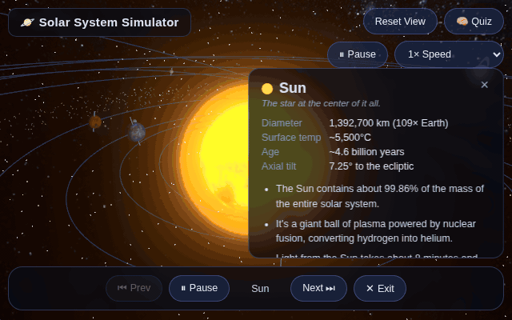

# Solar System Simulator



**[Live demo](https://devniall.github.io/solar-system-sim/)**

A dependency-light, WebGL solar system visualizer built with [Three.js](https://threejs.org/) (via npm, bundled with [Vite](https://vitejs.dev/)). Designed as an educational tool for high-school-level astronomy: explore the Sun and all eight planets, click on any body for real facts, and take a guided cinematic tour of the whole system.

## Running locally

This project uses [Vite](https://vitejs.dev/) for local development and bundling. You'll need [Node.js](https://nodejs.org/) installed.

```bash
npm install
npm run dev
```

Then open the URL Vite prints (usually `http://localhost:5173/`) in your browser.

To produce a production build (output goes to `dist/`):

```bash
npm run build
npm run preview   # optional: serve the built dist/ output locally
```

## Features

- Sun + all 8 planets (Mercury–Neptune), each with real NASA/JPL-derived texture maps, distinct size, orbiting at different relative speeds.
- Moons for Earth, Mars, Jupiter, and Saturn (the Moon; Phobos & Deimos; Io, Europa, Ganymede & Callisto; Enceladus & Titan), each orbiting its planet at its own relative speed.
- Earth gets a day-map, specular map (oceans reflect more than land), and an additive cloud layer; Saturn gets a real translucent ring texture.
- A soft sun glow (backside corona sphere + additive-blended radial-gradient sprite) stands in for full bloom postprocessing while keeping the app a plain-`<script>`, no-build-step setup.
- Starfield background: procedural points plus a real Milky Way skybox texture.
- Free camera controls: left-drag to orbit, right-drag to pan, scroll to zoom.
- Click any body to open an info panel with real astronomical facts (diameter, day/year length, moons, fun facts).
- **Guided tour**: click "Start Tour" to fly smoothly from the Sun out through every planet in order, pausing at each to show its facts. The camera continuously tracks each planet's live (still-orbiting) position — both mid-flight and for the whole pause at a stop — so it never drifts off target. Use the tour bar to go to the Previous/Next stop, Pause/Resume, or Exit back to free exploration at any time.
- "About this simulation" panel explaining the scale tradeoffs (see below).

## Textures

Real diffuse texture maps (plus Earth's cloud/specular layers and Saturn's ring alpha texture) are from [Solar System Scope](https://www.solarsystemscope.com/textures/), distributed under [CC-BY 4.0](https://creativecommons.org/licenses/by/4.0/). They're committed locally under `public/textures/` (not hot-linked) so the app doesn't depend on a third-party image host staying up. If any texture fails to load for any reason, materials gracefully fall back to their solid base color — the app never crashes or shows a broken-image icon.

## Deliberate scale/accuracy tradeoffs

This simulator intentionally is **not to scale**, and says so in the UI:

- **Planet sizes** are exaggerated (especially the smaller inner planets) relative to the Sun so they remain visible — in reality the Sun is ~109x Earth's diameter, which would render most planets as invisible specks.
- **Orbital distances** use a compressed, roughly logarithmic layout so the whole system (Mercury through Neptune) fits in one viewport without needing the camera to travel astronomical (pun intended) distances.
- **Orbital speeds** preserve the *relative* ordering from real physics (inner planets orbit much faster than outer ones, consistent with Kepler's third law) but are scaled up dramatically for visible motion — they are not in true proportion to each other beyond ordering/relative ratios.
- Axial tilts and orbital inclinations are simplified or omitted for clarity, and only the largest/best-known moons are modelled (Earth's Moon; Mars' Phobos & Deimos; Jupiter's four Galilean moons; Saturn's Titan & Enceladus). Moon sizes, orbital distances, and orbit speeds are exaggerated even more aggressively than the planets' — real moons would be sub-pixel specks hugging their planet — though relative ordering within each moon system (largest moon, fastest orbit) is kept true to life.

All non-geometric facts presented in the info panels (diameters, day/year lengths, moon counts, and other details) are real, drawn from published NASA/JPL data.

## Project structure

- `index.html` — page markup, UI panels (info panel, tour bar, about modal), and the Vite entry `<script type="module">` tag.
- `src/data.js` — Sun/planet/moon data: visual parameters (color, compressed size/distance/speed, texture paths) and real astronomical facts.
- `src/app.js` — Three.js scene setup, texture loading (with fallback), custom camera controls (orbit/pan/zoom), raycasting/selection, and the guided tour state machine (including live camera tracking of moving targets).
- `public/textures/` — committed CC-BY 4.0 texture maps (see Textures section above), served as-is by Vite from the project root.
- `vite.config.js` — Vite build config, including the `base` path required for GitHub Pages deployment.
- `.github/workflows/deploy.yml` — builds the project and deploys `dist/` to GitHub Pages on push to `main`.

This is a standard [Vite](https://vitejs.dev/) project with Three.js (`three@0.160.0`) installed as an npm dependency (see `package.json`).
